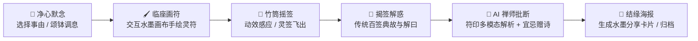

# 🪷 观音灵签 · Cyber Guanyin Fortune

<div align="center">

```text
 ╭─────────────────────────────────────────────────────────────╮
 │                                                             │
 │      📿  一 念 心 清 净  ·  处 处 莲 花 开  🪷             │
 │                                                             │
 │   赛博功德  ✕  东方水墨玄学  ✕  Gemini 多模态 AI 灵动解签  │
 │                                                             │
 ╰─────────────────────────────────────────────────────────────╯
```

[](https://react.dev/)
[](https://www.typescriptlang.org/)
[](https://tailwindcss.com/)
[](https://ai.google.dev/)
[](https://expressjs.com/)
[](LICENSE)

<br/>

**「观音灵签」** 是一款融合 **东方禅意美学** 与 **现代 AI 科技** 的沉浸式心灵决疑与功德修持应用。  
无论你是想在迷茫时求得一签指引，还是在加班摸鱼时敲敲木鱼积攒功德，这里都是你的赛博精神避风港 🍃。

[✨ 立即体验](#-快速开始--quick-start) • [🌟 核心特色](#-核心特色--features) • [🧠 AI 深度解签](#-ai-多模态解签原理) • [🚀 部署指南](#-部署与运维--deployment)

</div>

---

## 🌟 核心特色 · Features

### 🎋 1. 沉浸式求签三部曲 (Traditional Divination Ritual)
* **🧘 第一步 · 净心默念**：支持事业功名、姻缘情感、财运投资、健康平安、学业升迁、心惑决疑等多分类启愿，配以颂钵清音，静坐凝神。
* **🖌️ 第二步 · 临座画符与摇签**：独创互动水墨画布，亲笔挥毫临摹或手绘灵符印契；伴随清脆的竹签摇晃与重力动效，灵签自现。
* **🎴 第三步 · 揭签解惑**：完整呈现《观音灵签》吉凶等阶（上上/大吉/中吉/中平/下下等）、诗意四句、历史典故与古法解曰。

---

### 🤖 2. Gemini 多模态 AI 禅师批断 (AI Master Insights)
* **识墨辨意**：将你**亲手绘制的水墨符印**传入 Gemini 视觉大模型，感应笔锋气韵与内心隐秘波动。
* **因缘合参**：结合所问之事与传统签诗，生成直击心灵的白话拆解、禅理点拨。
* **实修宜忌与回向诗**：给出当下行事的「宜」与「忌」，并量身赠予一首四言/七言结缘回向绝句。

---

### 🐟 3. 赛博电子木鱼 (Cyber Wooden Fish)
* **功德 +1，烦恼 -1**：丝滑敲击动效与清脆立体声木鱼音效。
* 打工人排解焦虑、会议摸鱼、考试祈福的赛博神器！

---

### 📜 4. 百签典藏与履历沉淀 (Full Archive & History)
* **百年古本全收录**：完整内置《观音灵签一百签》全集，支持按吉凶分类筛选与搜索研读。
* **结缘印鉴卡**：支持一键生成典雅国风签文海报，保存并分享你的专属签文。
* **求签足迹**：本地自动沉淀求签历史，随时复盘昔日机缘与心路历程。

---

### 🎧 5. 多感官禅意体验 (Sound & Aesthetics)
* 宣纸纹理、动态云雾、水墨飞溅粒子。
* 内置**颂钵定心声、挥毫落墨声、竹筒摇签声、开签金光音效、木鱼声**与震动反馈（Haptics）。

---

## 🎨 视觉与交互流程 · Ritual Flow



---

## 🛠️ 技术栈 · Tech Stack

| 领域 | 技术方案 | 亮点说明 |
| :--- | :--- | :--- |
| **前端框架** | React 19 + TypeScript + Vite 6 | 最新 React 19 流式特性与超快开发热更 |
| **样式与动效** | Tailwind CSS v4 + Framer Motion (motion) | 东方水墨材质拟真、丝滑仪式过场动画 |
| **大模型能力** | Google Gemini 3.7 / 2.5 (`@google/genai`) | 多模态图像理解手绘符印 + 结构化 JSON 批断输出 |
| **后端服务** | Node.js + Express + TSX / Esbuild | 极轻量服务端，兼顾静态托管与 AI 接口路由 |
| **多媒体与特效** | Web Audio API + HTML5 Canvas + Confetti | 自研纯代码音频合成与水墨笔触渲染引擎 |
| **容器与部署** | Docker + Docker Compose + AWS Shell 脚本 | 一键打包与云端轻量化秒级交付 |

---

## 🚀 快速开始 · Quick Start

### 1. 环境准备
确保你的设备已安装：
* [Node.js](https://nodejs.org/) (建议 Node.js 18+)
* npm 或 pnpm / yarn / bun

### 2. 克隆与安装依赖
```bash
git clone git@github.com:AUPaiDev/guanyin.git
cd guanyin/观音灵签

# 安装依赖
npm install
```

### 3. 配置 API Key
在项目根目录下创建 `.env` 或 `.env.local` 文件：
```env
# 填入你的 Google Gemini API Key
GEMINI_API_KEY="your_gemini_api_key_here"
```
> 💡 *若未配置 API Key，系统会自动无缝启用内置的高德禅师古法解签，依然可以顺畅完整地体验所有仪式功能！*

### 4. 启动开发服务器
```bash
npm run dev
```
打开浏览器访问 [http://localhost:3000](http://localhost:3000) 即可开始求签。

---

## 📦 生产构建与部署 · Deployment

### 本地编译构建
```bash
# 编译前端 SPA 与后端 Bundle (输出至 dist/)
npm run build

# 启动生产服务
npm run start
```

### Docker 容器化运行
```bash
# 1. 使用 Docker Compose 一键启动
docker compose up -d --build

# 2. 查看运行状态
docker compose ps
```

### 云服务器一键部署
项目自带 `deploy.sh` 部署脚本，支持一键 rsync 产物并启动远程 Docker 容器：
```bash
GEMINI_API_KEY="xxx" SERVER="your-server-ip" ./deploy.sh
```

---

## 💡 常见问题 · FAQ

<details>
<summary><b>Q1: 抽签的结果是纯随机的吗？</b></summary>
答：抽签算法基于《观音灵签一百签》真实典籍概率分布，结合求签者互动时间戳与手绘符印哈希感应，做到心诚则灵、随缘而应。
</details>

<details>
<summary><b>Q2: 手绘灵符真的会被 AI 识别吗？</b></summary>
答：是的！在提交抽签时，画布上的笔触数据会转为图像传递给 Gemini 多模态视觉模型，AI 会根据笔势的刚柔、走笔的舒展程度给予独特的禅宗象意解读。
</details>

<details>
<summary><b>Q3: 电子木鱼支持连续敲击吗？</b></summary>
答：支持！并且包含防连击重叠音效处理与悬浮上升的“功德+1”动效，让你敲得顺心、解压更过瘾。
</details>

---

## 📜 免责声明 · Disclaimer

> 🪷 **心存善念，行则将至。**  
> 本项目为结合传统民俗文化与现代多模态人工智能的探索性数字艺术与心理舒缓作品。  
> 所有签文与 AI 解读内容仅供文化鉴赏、灵感启发与娱乐交流，切勿替代专业心理咨询、医疗、法律或金融决策。请保持科学理性的生活态度，祝君吉星高照、万事胜意！
